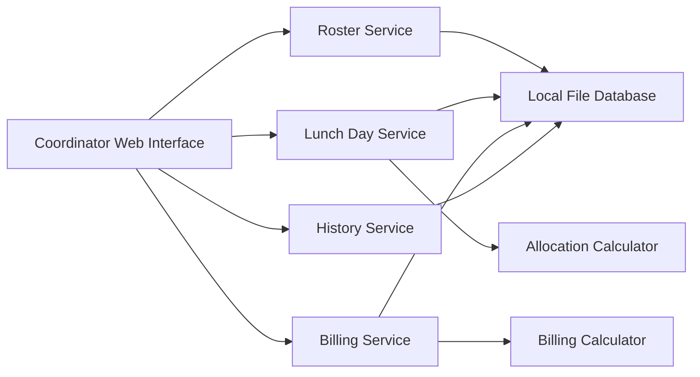

# Component Dependencies

## Dependency Matrix

| Consumer | Depends on | Communication |
|---|---|---|
| Coordinator Web Interface | RosterService, LunchDayService, BillingService, HistoryService | In-process application-service calls |
| RosterService | Local Persistence Component | Repository calls |
| LunchDayService | Roster Component, Allocation Component, Local Persistence Component | Service, pure domain, and repository calls |
| BillingService | Lunch Day Component, Billing Component, Local Persistence Component | Stored-record lookup, pure domain, and repository calls |
| HistoryService | Local Persistence Component | Read-only repository queries |
| Allocation Component | Shared Models | In-memory pure calculations |
| Billing Component | Shared Models | In-memory pure calculations |

## Data Flow

### Text Alternative

The coordinator interface calls four application services. Lunch Day Service calls the Allocation Calculator, and Billing Service calls the Billing Calculator. All four services read or write the Local File Database as needed; calculation components operate only on in-memory models.

## Coupling Rules

1. The user interface must not access repositories or calculation components directly.
2. Calculation components must not depend on persistence or user-interface concerns.
3. Services communicate through typed in-process calls within one deployable application.
4. The local persistence component is replaceable behind repository interfaces if a later release adopts a server database.