# Execution Plan

## Detailed Analysis Summary

### Change Impact Assessment

- **User-facing changes**: Yes. A Lunch Coordinator will use an internal web application to operate the office's daily lunch process.
- **Structural changes**: Yes. This is a new greenfield application with user interface, business logic, and persistent records.
- **Data model changes**: Yes. People, lunch days, group allocations, parcels, charges, and payment statuses require related persistent data.
- **API changes**: Yes. The web application requires interfaces for roster, lunch records, calculations, payment status, history, and balances.
- **NFR impact**: Limited. The first release is a small, internal application; resiliency, security, and property-based-testing extensions are disabled.

### Risk Assessment

- **Risk level**: Medium
- **Rollback complexity**: Moderate, because daily financial records must remain consistent.
- **Testing complexity**: Moderate, because allocation, rounding, and outstanding-balance rules need scenario coverage.

## Workflow Visualization

```mermaid
flowchart TD
    Start([User Request]) --> Workspace[Workspace Detection Completed]
    Workspace --> Requirements[Requirements Analysis Completed]
    Requirements --> Stories[User Stories Completed]
    Stories --> Plan[Workflow Planning In Progress]
    Plan --> Design[Application Design Execute]
    Design --> Units[Units Generation Execute]
    Units --> Functional[Functional Design Execute]
    Functional --> NfrReq[NFR Requirements Skip]
    NfrReq --> NfrDesign[NFR Design Skip]
    NfrDesign --> Infra[Infrastructure Design Skip]
    Infra --> Code[Code Generation Execute]
    Code --> Test[Build and Test Execute]
    Test --> End([Complete])

    style Workspace fill:#4CAF50,stroke:#1B5E20,stroke-width:3px,color:#fff
    style Requirements fill:#4CAF50,stroke:#1B5E20,stroke-width:3px,color:#fff
    style Stories fill:#4CAF50,stroke:#1B5E20,stroke-width:3px,color:#fff
    style Plan fill:#4CAF50,stroke:#1B5E20,stroke-width:3px,color:#fff
    style Design fill:#FFA726,stroke:#E65100,stroke-width:3px,stroke-dasharray: 5 5,color:#000
    style Units fill:#FFA726,stroke:#E65100,stroke-width:3px,stroke-dasharray: 5 5,color:#000
    style Functional fill:#FFA726,stroke:#E65100,stroke-width:3px,stroke-dasharray: 5 5,color:#000
    style Code fill:#4CAF50,stroke:#1B5E20,stroke-width:3px,color:#fff
    style Test fill:#4CAF50,stroke:#1B5E20,stroke-width:3px,color:#fff
    style NfrReq fill:#BDBDBD,stroke:#424242,stroke-width:2px,stroke-dasharray: 5 5,color:#000
    style NfrDesign fill:#BDBDBD,stroke:#424242,stroke-width:2px,stroke-dasharray: 5 5,color:#000
    style Infra fill:#BDBDBD,stroke:#424242,stroke-width:2px,stroke-dasharray: 5 5,color:#000
    style Start fill:#CE93D8,stroke:#6A1B9A,stroke-width:3px,color:#000
    style End fill:#CE93D8,stroke:#6A1B9A,stroke-width:3px,color:#000
    linkStyle default stroke:#333,stroke-width:2px
```

### Text Alternative

1. Completed: Workspace Detection, Requirements Analysis, and User Stories.
2. In progress: Workflow Planning.
3. Execute: Application Design, Units Generation, Functional Design, Code Generation, and Build and Test.
4. Skip: NFR Requirements, NFR Design, and Infrastructure Design.
5. Operations remains a future placeholder.

## Phases to Execute

### Inception

- [x] Workspace Detection - Completed.
- [x] Requirements Analysis - Completed.
- [x] User Stories - Completed.
- [x] Workflow Planning - Plan created; pending approval.
- [ ] Application Design - Execute.
  - **Rationale**: The application needs defined components, boundaries, data responsibilities, and business rules.
- [ ] Units Generation - Execute.
  - **Rationale**: The work spans a web interface, persistent records, allocation and cost logic, and reporting views, which benefit from structured units.

### Construction

- [ ] Functional Design - Execute.
  - **Rationale**: Group distribution, parcel rounding, deterministic currency allocation, and balance computation need a precise design.
- [ ] NFR Requirements - Skip.
  - **Rationale**: No additional NFR targets were selected; the initial deployment is a small, simple internal application.
- [ ] NFR Design - Skip.
  - **Rationale**: NFR Requirements is skipped.
- [ ] Infrastructure Design - Skip.
  - **Rationale**: The first release has no chosen cloud target or infrastructure change requirement.
- [ ] Code Generation - Execute.
  - **Rationale**: Implementation planning, application code, and focused tests are required.
- [ ] Build and Test - Execute.
  - **Rationale**: Build, functional verification, and test instructions are required.

### Operations

- [ ] Operations - Placeholder.
  - **Rationale**: Deployment and monitoring workflows are not part of the current AI-DLC operations stage.

## Estimated Delivery Scope

- **Stages to execute after workflow-plan approval**: Five.
- **Stages to skip**: Three conditional construction stages: NFR Requirements, NFR Design, and Infrastructure Design.
- **Primary goal**: Enable a coordinator to complete the daily lunch process and inspect every person's outstanding balance without manual calculations.
- **Key deliverables**: Application design, work-unit plan, functional design, internal web application, automated tests, and build/test instructions.
- **Quality gates**: Explicit approval of each required design and code-generation plan, automated calculation scenarios, and final build/test verification.